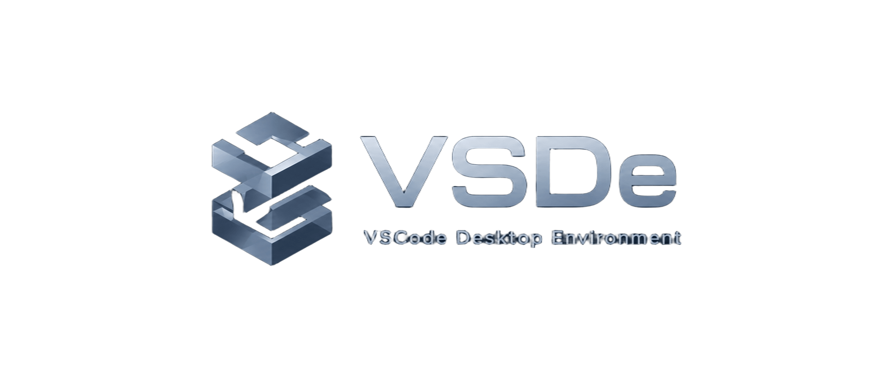

<p align="center" style="margin-bottom: 5px;">
  
</p>

<h1 align="center" style="margin: 5px 0 0 0;">
  VS Code Desktop Environment
</h1>

<p align="center" style="margin-top: 5px;">
  Ambiente de desenvolvimento focado em otimização e performance.
</p>

<p align="center">
  
  
  
  
</p>

## O que o instalador faz

- Instala e configura XRDP 
- Instala Pacotes necessários e configura ambiente de desenvolvimento
- Aplica ZRAM com compressão `lz4` para otimizar RAM em VMs
- Oculta entradas desnecessárias no menu de aplicativos
- Desabilita serviços não essenciais (cups, bluetooth, snapd, etc.)

---

## Requisitos

- Ubuntu 22.04 ou 24.04 (bare metal, VM ou VPS)
- Acesso `root` / `sudo`
- Conexão com a internet

---

## Instalação

```bash
git clone https://github.com/brunofoggiatto/vscode-desktop-environment.git
cd vscode-desktop-environment/scripts
sudo chmod +x install.sh #
sudo bash install.sh
```

Reinicie após a instalação:

```bash
sudo reboot
```

---

## Conexão RDP

| Campo | Valor |
|-------|-------|
| Host | IP da máquina |
| Porta | `3389` |
| Usuário | usuário Linux |
| Senha | senha Linux |

No Windows: **mstsc.exe** → inserir `<IP>:3389`.

---

## Comandos úteis

```bash
# IP da máquina
hostname -I

# Status do XRDP
systemctl status xrdp

# Reiniciar XRDP
sudo systemctl restart xrdp
```

---

## Desinstalar

```bash
sudo bash scripts/uninstall.sh
```

---

## Autor

**Bruno Foggiatto** — [@brunofoggiatto](https://github.com/brunofoggiatto)
